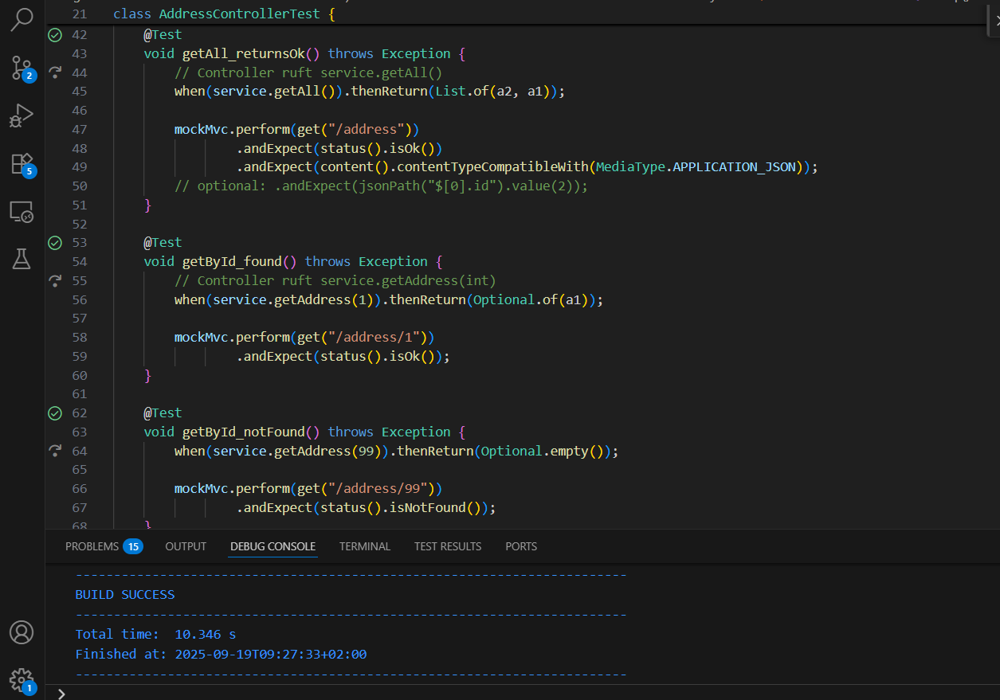

## Aufgabe 

## Relevante Dateien zum Erklären

### 1. `Address.java` (Entity)
- Beschreibt eine Adresse, wie sie in der Datenbank gespeichert wird.
- Felder: `id`, `firstName`, `lastName`, `street`, `zip`, `city`, `email`, `phone`.
- Enthält Getter/Setter, `equals()`, `hashCode()` und `toString()`.

### 2. `AddressRepository.java` (Repository)
- Schnittstelle zu Spring Data JPA.
- Erbt von `JpaRepository<Address, Long>`.
- Stellt Standardmethoden wie `findAll()`, `save()`, `findById()`, `deleteById()` bereit.

### 3. `AddressComparator.java` (Comparator)
- Implementiert die Vergleichslogik für Adressen.
- Sortiert **zuerst nach Nachname**, dann **nach Vorname**, und zuletzt **nach ID**.
- Behandelt auch `null`-Werte sinnvoll.

### 4. `AddressService.java` (Service)
- Geschäftslogik zwischen Controller und Repository.
- Verwendet den Comparator, um Ergebnisse sortiert zurückzugeben.
- Methoden:
  - `findAllSorted()`
  - `findById(Long id)`
  - `create(Address a)`
  - `update(Long id, Address updated)`
  - `delete(Long id)`

### 5. `AddressController.java` (Controller)
- Stellt die REST-API-Endpunkte zur Verfügung:
  - `GET /address` → alle Adressen (sortiert)
  - `GET /address/{id}` → Adresse nach ID
  - `POST /address` → neue Adresse anlegen
  - `PUT /address/{id}` → Adresse aktualisieren
  - `DELETE /address/{id}` → Adresse löschen

---

##  Tests

### 6. `AddressTest.java`
- Testet Getter/Setter und die `equals()` / `hashCode()` Methoden der Entity.

### 7. `AddressComparatorTest.java`
- Testet die Sortierlogik des Comparators.
- Prüft: Nachname → Vorname → ID → `null`-Behandlung.

### 8. `AddressServiceTest.java`
- Testet den Service **ohne echte H2-Datenbank**.
- `AddressRepository` wird mit **Mockito** gemockt.
- Prüft Methoden `findAllSorted`, `create`, `update`, `delete`.

### 9. `AddressControllerTest.java`
- Testet die REST-Endpoints mit **MockMvc**.
- `AddressService` wird gemockt → keine DB-Abhängigkeit.
- Prüft Status-Codes (`200 OK`, `404 Not Found`, etc.).

---

