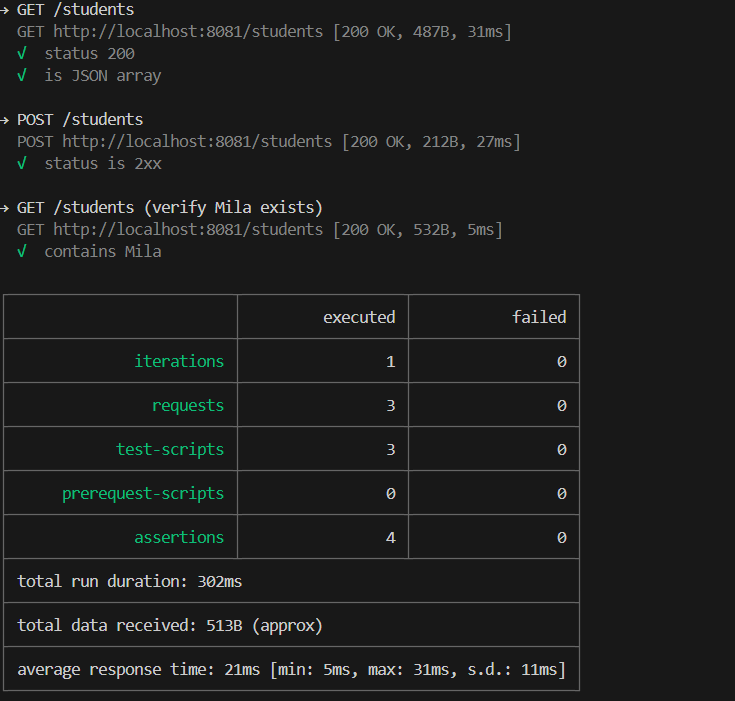

## Aufgabe 
## Übung 1 
### Eingesetztes Tool

Ich habe mich für Postman + Newman entschieden:

**Postman:** Erstellung einer Test-Collection (StudentAPI.json).

**Newman:** CLI-Tool, das die Postman-Collection automatisiert ausführt und Ergebnisse in der Konsole oder als Report ausgibt.

**Vorteil:** Tests sind einfach erweiterbar, können ohne Java-Code gepflegt werden und laufen auch in Docker/CI/CD-Pipelines.

### Inhalt der Collection StudentAPI.json

Folgendes wird getestet: 

1. GET /students

- Erwartet Status 200

- Antwort ist ein JSON-Array

2. POST /students

- Erwartet Status 2xx

- Fügt einen neuen Studenten hinzu (name: "Mila", email: "mila@tbz.ch")

3. GET /students (nach POST)

- Prüft, dass der neue Student in der Liste enthalten ist

### Backend starten
``mvn spring-boot:run``  
``newman run src/test/java/ch/tbz/m450/testing/tools/StudentAPI.json``

### Relsutat 

